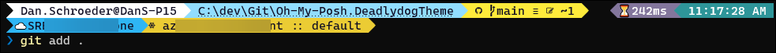

# Deadlydog Oh My Posh Theme

## 💬 Description

This is a custom theme for [Oh My Posh](https://ohmyposh.dev), called `deadlydog`.

## 🖼 Screenshot and features

This is an example what the command prompt looks like with this theme:



The top line's left block displays:

- The logged in user and the computer name.
  - Handy if you run as different users or SSH into different servers.
- The full current directory path.
  - Easy to select and copy the path, and can `Ctrl`+`Click` it to open in File Explorer.
- If in a Git repository, shows the current Git branch and status.
- If an error occurred on the previous command, a red `!` is shown (not shown in screenshot).
  - Allows you to easily see if the previous executable returned a non-zero exit code.

The top line's right block displays:

- How long the previous command took to run.
  - Great for when you start a long-running operation and walk away from your PC.
- The current time that the information was displayed.

The next line will show different information depending on the context:

- If logged into the Az CLI, shows the current Azure subscription.
- If logged into Kubernetes, shows the current k8s context and namespace.

Lastly, the prompt character is shown on the final line to accept user input.

## ❓ Why this exists

I wasn't quite happy with [the out-of-the-box themes](https://ohmyposh.dev/docs/themes), so I created this one.

## 🚀 Quick start

To use this theme:

1. [Install Oh My Posh](https://ohmyposh.dev/docs/installation/windows) if you haven't already.
   1. On Windows you can install it via `winget` with the following command:

      ```powershell
      winget install JanDeDobbeleer.OhMyPosh
      ```

1. Download and unzip [the latest release](https://github.com/deadlydog/Oh-My-Posh.DeadlydogTheme/releases) of the `deadlydog.omp.json` theme file.
1. Place the `deadlydog.omp.json` file somewhere where it can permanently live on your computer.
   A good place is the default Posh Themes Path, which you can find by running `$env:POSH_THEMES_PATH` in PowerShell.
   e.g. C:\Users\Your Name\AppData\Local\Programs\oh-my-posh\themes\
1. [Set the theme in Oh My Posh](https://ohmyposh.dev/docs/installation/customize).

   - The command will vary depending on which shell you are in.
   - You may need to change the file path to where you saved the `deadlydog.omp.json` file on your computer.
   - In PowerShell it would look something like:

   ```powershell
   oh-my-posh init pwsh --config $env:POSH_THEMES_PATH/deadlydog.omp.json | Invoke-Expression
   ```

   - You will want to add the above line to your prompts startup file so it runs every time you open a new terminal window.
   - For PowerShell, you can use the `$PROFILE` variable to find your startup file.

## 🕵️‍♀️ Troubleshooting

If some characters do not show up properly, or you get errors like the following, it likely means that your terminal is not using a font that supports the unicode characters used in this theme:

> invalid char escape
>
> literal not terminated
>
> invalid char literal

I recommend using the `CaskaydiaCove Nerd Font` font, which can be [downloaded from here](https://www.nerdfonts.com/font-downloads).
Once you have downloaded and installed the font, you will need to [update your terminal to use it](https://blog.danskingdom.com/Update-your-terminal-prompt-and-font-in-Windows-Terminal-and-VS-Code-and-Visual-Studio/).

## Development information

You can browse and search for emojis and their unicode values on these pages:

- <https://www.fileformat.info/info/emoji/list.htm>
- <https://www.compart.com/en/unicode>

## 📃 Changelog

See what's changed in the application over time by viewing [the changelog](Changelog.md).

## 💳 Donate

Buy me a donut 🍩 for providing this theme open source and for free 🙂

[](https://www.paypal.me/deadlydogDan/5USD)
